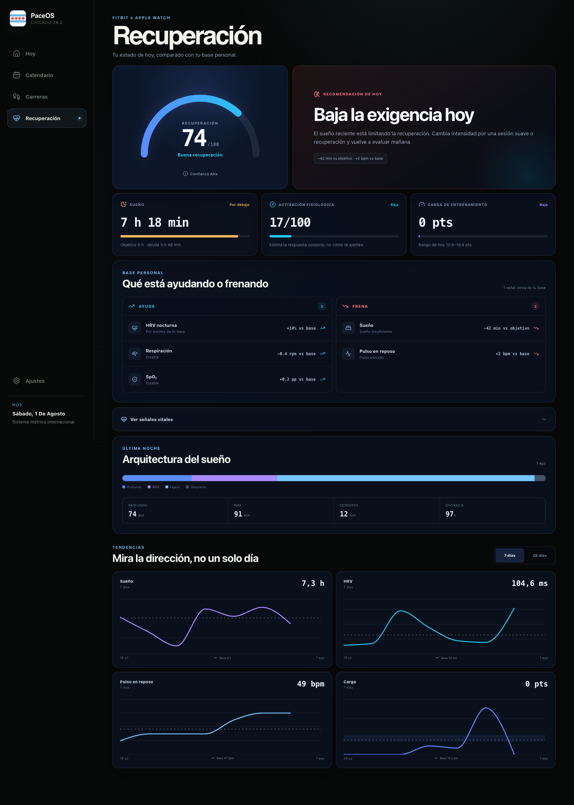
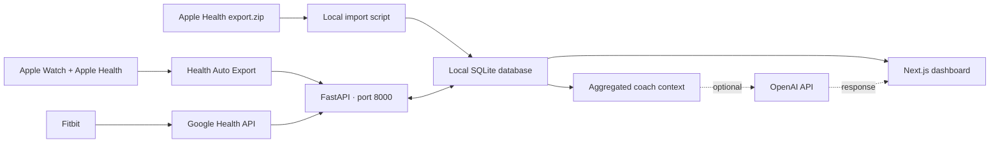

# PaceOS

**A private, self-hosted running dashboard powered by Apple Health, Apple Watch, Fitbit, and an optional AI coach.**

[Download the latest ZIP](https://github.com/Ivo196/strava-agent/archive/refs/heads/main.zip) · [Clone the repository](https://github.com/Ivo196/strava-agent.git)

PaceOS turns workout, recovery, and sleep data into a daily training view. It combines a Next.js dashboard with a FastAPI backend and stores everything in a local SQLite database. You can use the dashboard without cloud hosting and add each data source only when you need it.

> [!IMPORTANT]
> PaceOS is currently a personal, single-user project. The interface and AI coach are in Spanish, and the bundled training plan is fixed around the 2026 Chicago Marathon. Despite the repository name, the current version does **not** connect to Strava.



## What PaceOS does

- Shows today's session and the next seven days of the training plan.
- Tracks weekly distance, recent load, long runs, and running history.
- Displays route, heart-rate, elevation, pace, and running-dynamics data for Apple Watch runs.
- Combines sleep, HRV, resting heart rate, SpO2, respiration, temperature, heart-rate zones, and VO2 max into a recovery view.
- Compares completed training with a fixed plan without silently rewriting that plan.
- Provides an optional AI coach grounded in the athlete's local data.
- Keeps secrets, health exports, and the SQLite database outside Git.

## How it works



Apple Health is the primary workout source. Google Health complements it with Fitbit recovery data. The API normalizes and deduplicates incoming records before the dashboard reads them from SQLite.

## Quick start

### 1. Requirements

- Git, unless you use the ZIP download.
- Python 3.11 or newer.
- Node.js 20 or newer with npm.
- macOS, Linux, or Raspberry Pi: Bash and `curl`.
- Windows: PowerShell 5 or newer.

The setup scripts install project dependencies, but they do not install Python, Node.js, Git, or other system packages.

### 2. Download the project

Choose one option:

```bash
# Option A: clone with Git
git clone https://github.com/Ivo196/strava-agent.git
cd strava-agent
```

Or [download the repository as a ZIP](https://github.com/Ivo196/strava-agent/archive/refs/heads/main.zip), extract it, and open a terminal in the extracted folder.

### 3. Install and start

#### macOS, Linux, or Raspberry Pi

```bash
./setup.sh
./start.sh
```

Open <http://localhost:3000>. From another device on the same network, use `http://DEVICE-IP:3000`.

Stop PaceOS with:

```bash
./stop.sh
```

#### Windows

Run these commands from PowerShell:

```powershell
powershell -ExecutionPolicy Bypass -File ./setup.ps1
powershell -ExecutionPolicy Bypass -File ./start.ps1
```

Open <http://localhost:3100>.

Stop PaceOS with:

```powershell
powershell -ExecutionPolicy Bypass -File ./stop.ps1
```

The first setup can take several minutes because it creates a Python virtual environment, installs the backend and frontend dependencies, and builds the production frontend.

### 4. Verify the installation

The dashboard starts with an empty local database, so seeing no activities on the first run is expected.

- Dashboard: <http://localhost:3000> on macOS/Linux/Raspberry Pi or <http://localhost:3100> on Windows.
- API health check: <http://localhost:8000/api/health>.
- Interactive API documentation: <http://localhost:8000/docs>.

The health endpoint should return:

```json
{"status":"ok"}
```

## Add your data

All integrations are optional. You can start PaceOS first and configure them later.

### Import an existing Apple Health export

Apple Health can create an `export.zip` containing your historical data. After running the setup script, import it while PaceOS is stopped.

On macOS, Linux, or Raspberry Pi:

```bash
./.venv/bin/python scripts/import_apple_health_export.py /path/to/export.zip
```

On Windows:

```powershell
./.venv/Scripts/python.exe scripts/import_apple_health_export.py "C:\path\to\export.zip"
```

The importer reads the archive directly; you do not need to extract it. Large Apple Health exports may take a while to process.

### Sync Apple Health automatically

[Health Auto Export](https://www.healthexportapp.com/) can send new workouts and recovery metrics from an iPhone to PaceOS.

The setup script creates `.env` and generates a random `APPLE_HEALTH_API_KEY`. Use that value as the `X-API-Key` header in Health Auto Export, then send JSON v2 requests to:

```text
POST http://DEVICE-IP:8000/api/import/apple-health
X-API-Key: YOUR_APPLE_HEALTH_API_KEY
Content-Type: application/json
```

Recommended automations:

1. **Workouts** — include workout metrics and routes; group by minutes.
2. **Health Metrics** — use aggregated sleep and daily grouping.

Enable batch requests and resend a short rolling window, such as the previous seven days. The receiver is idempotent: repeated samples are updated or ignored instead of being duplicated.

For running activities, PaceOS only accepts records whose source can be identified as Apple Watch. Other workout types can still be stored for later analysis. If the iPhone connects from outside your home network, expose the endpoint through HTTPS and protect the API key.

### Connect Fitbit through Google Health

1. Create a Google OAuth web client with access to the Google Health API.
2. Add this exact redirect URI for a local installation:

   ```text
   http://localhost:8000/api/google-health/callback
   ```

3. Download the OAuth client JSON and save it as `data/google-health-client.json`.
4. On macOS, Linux, or Raspberry Pi, set `PACEOS_FRONTEND_URL=http://localhost:3000` in `.env`. Windows already uses the default port `3100`.
5. Restart PaceOS.
6. Open **Settings** (`Ajustes` in the current Spanish interface) and select **Connect with Google** (`Conectar con Google`).

The first connection imports recent history. Later syncs update the local database incrementally, and the backend checks for new Google Health data automatically.

This local OAuth example assumes the browser and PaceOS run on the same computer. A headless or remotely accessed Raspberry Pi needs a routable HTTPS callback configured both in Google Cloud and in the downloaded OAuth client JSON.

### Enable Coach AI

Coach AI is disabled unless you provide an OpenAI API key. Edit `.env` and restart PaceOS:

```dotenv
OPENAI_API_KEY=your_private_api_key
OPENAI_MODEL=gpt-5.6-luna
```

OpenAI API usage is billed separately. PaceOS sends an aggregated coaching context—profile, recovery metrics, recent activity summaries, discomfort notes, and upcoming plan weeks. It does not send the Apple Health ZIP or GPS routes.

## Configuration

The setup script copies `.env.example` to `.env` and generates the Apple Health receiver key. Existing `.env` files are never overwritten.

| Variable | Required | Purpose | Default |
| --- | --- | --- | --- |
| `APPLE_HEALTH_API_KEY` | For automatic Apple Health sync | Authenticates Health Auto Export requests | Randomly generated during setup |
| `OPENAI_API_KEY` | For Coach AI | Authenticates backend requests to OpenAI | Empty; Coach AI disabled |
| `OPENAI_MODEL` | No | Selects the model used by Coach AI | `gpt-5.6-luna` |
| `GOOGLE_HEALTH_CREDENTIALS_FILE` | For Google Health | Path to the Google OAuth client JSON | `data/google-health-client.json` |
| `PACEOS_FRONTEND_URL` | No | Redirect target after Google authorization | `http://localhost:3100` |

If you run the macOS/Linux frontend on port `3000` and connect Google Health, set `PACEOS_FRONTEND_URL=http://localhost:3000` in `.env` before authorizing.

## Ports and local files

| Item | Location |
| --- | --- |
| FastAPI backend | `http://localhost:8000` |
| Next.js frontend on macOS/Linux/Raspberry Pi | `http://localhost:3000` |
| Next.js frontend on Windows | `http://localhost:3100` |
| SQLite database | `data/strava_agent.db` |
| Runtime logs and process IDs | `.run/` |
| Google OAuth client | `data/google-health-client.json` |
| Local secrets | `.env` |

The `data/`, `.run/`, and `.env` paths are ignored by Git.

## Privacy and security

- Health records, OAuth tokens, and API keys are stored locally and excluded from the repository.
- Google Health data is requested with read-only scopes.
- OpenAI receives data only when Coach AI is enabled and used.
- Do not commit or share `.env`, `data/`, health export ZIPs, FIT/GPX files, or `cloudflared.yml`.
- Back up `.env` and `data/` privately if you move PaceOS to another computer.

To migrate an existing installation, clone PaceOS on the new machine, copy `.env` and the complete `data/` folder through a private channel, run the appropriate setup script, and then start the app.

## Development

Install everything with the normal setup script, then run the services in separate terminals.

Backend:

```bash
./.venv/bin/python -m uvicorn api:app --reload --port 8000
```

Frontend:

```bash
cd frontend
npm run dev -- --port 3000
```

Run the checks:

```bash
./.venv/bin/python -m pytest -q
npm --prefix frontend run lint
npm --prefix frontend run build
```

After pulling new code for a production-style local installation, run `./setup.sh` or `./setup.ps1` again so dependencies and the frontend build stay current.

## Project structure

```text
.
├── api.py                         # FastAPI routes
├── src/strava_agent/              # Imports, storage, metrics, plan, and AI coach
├── frontend/                      # Next.js application
├── scripts/import_apple_health_export.py
├── tests/                         # Backend tests
├── setup.sh / setup.ps1           # Installation
├── start.sh / start.ps1           # Start local services
└── stop.sh / stop.ps1             # Stop local services
```

## Raspberry Pi deployment

The repository includes a deployment workflow for the maintainer's self-hosted Raspberry Pi runner. It triggers on pushes to `main` and expects the runner label `paceos`, the checkout path `/home/ivo196/.openclaw/workspace/strava-agent`, and user-level systemd services named `strava-agent-api.service` and `strava-agent-web.service`.

This workflow is installation-specific. Forks should adapt or disable `.github/workflows/deploy-raspberry.yml` and `scripts/deploy_raspberry.sh` before using them.

## Current limitations

- The product interface and coach responses are in Spanish.
- The included training calendar is a fixed personal plan for the Chicago Marathon on October 11, 2026; it is not a general plan generator.
- The app is designed for one trusted user, not for public multi-user hosting.
- Apple Watch is the accepted source for runs shown in the dashboard.
- There is no Strava API integration in the current version.

Training load and recovery scores are reference signals, not medical advice or injury predictions. Stop training and seek qualified medical care for severe or persistent pain, chest pain, fainting, or unusual shortness of breath.

## Troubleshooting

- **The app does not start:** check `.run/api.err.log` and `.run/web.err.log`.
- **A port is already in use:** stop the process using port `8000`, `3000`, or `3100`, then run the start script again.
- **The dashboard is empty:** import an Apple Health export or configure Health Auto Export; a fresh database contains no activities.
- **Coach AI is unavailable:** add `OPENAI_API_KEY` to `.env` and restart both services.
- **Google authorization returns to the wrong port:** set `PACEOS_FRONTEND_URL` to the exact dashboard URL, restart PaceOS, and authorize again.
